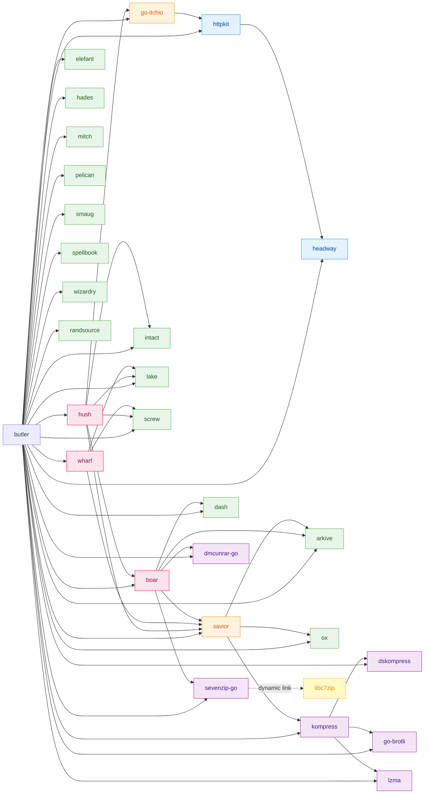

# butler

[](https://goreportcard.com/report/github.com/itchio/butler)


butler is *the itch.io command-line tools* - all by itself.

**It is used by:**

  * Content creators on [itch.io](https://itch.io) to push builds quickly & reliably
  * [the itch app](https://github.com/itchio/itch) for some network, filesystem and patching operations

## Documentation

  * **butler docs:** <https://itch.io/docs/butler>
  * **butler docs (bleeding edge):** <https://itchio.github.io/butler/>
  * **butlerd (daemon) API docs (bleeding edge):** <https://itchio.github.io/butler/butlerd/>

Questions about butler are welcome on its [Issue tracker](https://github.com/itchio/butler/issues),
or, if the matter is private, [itch.io support](https://itch.io/support).

## Butler architecture

Butler has a somewhat complicated collection of sub-packages to facilitate its
various features. Here's a high level overview to help with understanding and
development:



| Package | Purpose |
|---------|---------|
| [go-itchio](https://github.com/itchio/go-itchio) | itch.io API client library |
| [wharf](https://github.com/itchio/wharf) | Delta patching, binary diffing, pwr format |
| [hush](https://github.com/itchio/hush) | Installation receipts and manifests |
| [boar](https://github.com/itchio/boar) | Multi-format archive extraction (7z, RAR, ZIP) |
| [savior](https://github.com/itchio/savior) | Archive extraction and seeking |
| [httpkit](https://github.com/itchio/httpkit) | HTTP utilities and streaming |
| [headway](https://github.com/itchio/headway) | Progress tracking and unit formatting |
| [arkive](https://github.com/itchio/arkive) | ZIP/archive format support |
| [dash](https://github.com/itchio/dash) | Game configuration and metadata |
| [elefant](https://github.com/itchio/elefant) | ELF binary parser (Linux) |
| [pelican](https://github.com/itchio/pelican) | PE binary parser (Windows) |
| [lake](https://github.com/itchio/lake) | Binary storage pools, file structure tracking |
| [intact](https://github.com/itchio/intact) | File integrity verification |
| [ox](https://github.com/itchio/ox) | OS abstractions (registry, system calls) |
| [smaug](https://github.com/itchio/smaug) | Windows installer/runtime detection |
| [spellbook](https://github.com/itchio/spellbook) | File magic number detection |
| [wizardry](https://github.com/itchio/wizardry) | Binary file utilities |
| [hades](https://github.com/itchio/hades) | SQLite schema and queries |
| [screw](https://github.com/itchio/screw) | Game manifest utilities |
| [mitch](https://github.com/itchio/mitch) | Test fixtures (dev only) |
| [kompress](https://github.com/itchio/kompress) | Compression abstraction layer |
| [dskompress](https://github.com/itchio/dskompress) | Decompression utilities |
| [go-brotli](https://github.com/itchio/go-brotli) | Brotli compression support |
| [lzma](https://github.com/itchio/lzma) | LZMA compression support |
| [randsource](https://github.com/itchio/randsource) | Random source utilities |
| [sevenzip-go](https://github.com/itchio/sevenzip-go) | 7-zip library bindings (dynamically links to [libc7zip](https://github.com/itchio/libc7zip)) |
| [dmcunrar-go](https://github.com/itchio/dmcunrar-go) | RAR decompression support |

## generous (Code Generation)

butler includes a code generation tool called **generous** (`butlerd/generous/`) that parses Go type definitions (primarily `butlerd/types.go` and `butlerd/types_launch.go`) and their comment annotations (e.g. `@name`, `@category`, `@caller`) to generate API bindings and documentation.

**After changing butler's API types**, run the following from the butler repo:

```bash
# Regenerate Go code, JSON spec, and API docs
go run ./butlerd/generous godocs
```

This generates three files that should be committed to this repo:

| File | Purpose |
|------|---------|
| `butlerd/messages/messages.go` | Go request/notification handlers used by butler |
| `butlerd/generous/spec/butlerd.json` | JSON API spec |
| `butlerd/generous/docs/README.md` | API docs (uploaded to docs.itch.zone by CI) |

generous also has a `ts` mode for generating TypeScript bindings used by the [itch](https://github.com/itchio/itch) app. From the itch repo, run `npm run sync-butler` (which requires this repo checked out as a sibling directory).

## Debug environment variables

| Variable | Description |
|----------|-------------|
| `BUTLER_SQL_DEBUG=1` | Log all SQL queries through the hades ORM |
| `BUTLER_HTTP_DEBUG=1` | Log HTTP requests made by the go-itchio API client (method, URL, status, duration) |
| `BUTLER_JSON_RPC_DEBUG=1` | Log JSON-RPC 2.0 request/response messages |
| `BUTLER_DEBUG_HOST` | Host for the pprof HTTP debug server (default: `localhost`) |
| `BUTLER_DEBUG_PORT` | Port for the pprof HTTP debug server (enables it when set) |
| `BUTLER_FULL_MSI_LOG=1` | Show full MSI installer log output (Windows) |
| `BUTLER_API_KEY` | Provide an itch.io API key via environment instead of `butler login` |
| `BUTLER_MANUAL_OAUTH=1` | Use manual copy-paste OAuth flow for headless/remote login |

## Integrations

The following projects integrate butler as part of their workflow:

  * [itchy-electron](https://github.com/erbridge/itchy-electron) lets you package your Electron games for itch.io and upload them there
  * [gradle-butler-plugin](https://github.com/mini2Dx/gradle-butler-plugin) is a Gradle plugin for automatically installing, updating, and running butler as part of your build.

## Authors

butler was mostly written by [Amos Wenger](https://github.com/fasterthanlime), but wouldn't have
been possible without the work of many before him.

Amos would like to thank in particular Leaf Corcoran, Jesús Higueras and Tomáš Duda.

## License

butler is released under the MIT License. See the [LICENSE](LICENSE) file for details.

## Additional licenses

While butler built from source is fully MIT-licensed, some components it can use at runtime
(if present) have other licenses:

  * The 7-zip decompression engine (the `github.com/itchio/boar/szextractor` package) opens
  dynamic libraries for [libc7zip][], and [7-zip][], which have components licensed under the LGPL 2.1 license
  and the MPL 2.0 license, along with specific terms for the RAR extraction code.

[libc7zip]: https://github.com/itchio/libc7zip
[7-zip]: http://7-zip.org/faq.html
[7-zip FAQ]: http://7-zip.org/faq.html
