# butlerd Launch Message Flow

## Overview

When the itch app calls `Launch`, butlerd orchestrates a multi-phase flow involving
target selection, prerequisites, sandbox setup, and game execution. Messages are
either **requests** (require a response from the client) or **notifications**
(informational, no response needed).

## Full Message Flow

```mermaid
sequenceDiagram
    participant Client as itch app (client)
    participant Butlerd as butlerd
    participant API as itch.io API

    Client->>Butlerd: Launch(caveId, prereqsDir, sandbox?)

    Note over Butlerd: Acquire install folder lock

    %% License check
    opt Game has a license
        Butlerd->>Client: AcceptLicense(text)
        Client-->>Butlerd: accept: true/false
        Note over Butlerd: Abort if not accepted
    end

    %% Target selection
    Note over Butlerd: getTargets(): read manifest,<br/>filter candidates by platform

    alt No launch candidates found
        Butlerd-->>Client: Error: CodeNoLaunchCandidates
    else Multiple launch targets
        Butlerd->>Client: PickManifestAction(actions[])
        Client-->>Butlerd: index (selected action)
        Note over Butlerd: Abort if user cancelled
    else Single target
        Note over Butlerd: Auto-select the only target
    end

    %% Strategy branching
    Note over Butlerd: Determine launch strategy<br/>from selected target

    alt Strategy: Native
        Note over Butlerd: Configure target,<br/>read PE info (Windows)

        %% Prerequisites (native only)
        rect rgb(240, 248, 255)
            Note over Butlerd: Handle prerequisites
            opt Has prerequisites to install
                Butlerd-)Client: PrereqsStarted(tasks{})
                loop For each prereq task
                    Butlerd-)Client: PrereqsTaskState(name, status, progress)
                end
                alt Prerequisites succeeded
                    Butlerd-)Client: PrereqsEnded
                else Prerequisites failed
                    Butlerd->>Client: PrereqsFailed(error, errorStack)
                    Client-->>Butlerd: continue: true/false
                    Note over Butlerd: Abort if user chose not to continue
                end
            end
        end

        %% Sandbox setup
        opt Sandbox enabled
            Note over Butlerd: Select sandbox runner:<br/>Linux: bubblewrap or firejail<br/>Windows: elevated sandbox (fuji)
            opt Sandbox needs elevated setup
                Butlerd->>Client: AllowSandboxSetup()
                Client-->>Butlerd: allow: true/false
                Note over Butlerd: Abort if not allowed<br/>Windows: UAC prompt follows<br/>Linux: pkexec prompt follows
            end
        end

        %% Session tracking
        Butlerd->>API: CreateUserGameSession()
        API-->>Butlerd: session created

        %% Game execution
        Butlerd-)Client: LaunchRunning
        Note over Butlerd: Execute game process<br/>(love, jar, or native binary)

        loop Every 60 seconds while running
            Butlerd->>API: UpdateUserGameSession(secondsRun)
        end

        Note over Butlerd: Game process exits
        Butlerd-)Client: LaunchExited

        Butlerd->>API: UpdateUserGameSession(final stats)

    else Strategy: HTML
        Butlerd->>API: CreateUserGameSession()
        Butlerd-)Client: LaunchRunning
        Butlerd->>Client: HTMLLaunch(rootFolder, indexPath, args, env)
        Client-->>Butlerd: (completed)
        Butlerd-)Client: LaunchExited
        Butlerd->>API: UpdateUserGameSession(final stats)

    else Strategy: Shell
        Butlerd->>Client: ShellLaunch(itemPath)
        Client-->>Butlerd: (completed)

    else Strategy: URL
        Butlerd->>Client: URLLaunch(url)
        Client-->>Butlerd: (completed)
    end

    Butlerd-->>Client: LaunchResult
```

## Message Reference

### Requests (client must respond)

| Message | Params | Response | When |
|---|---|---|---|
| `AcceptLicense` | `text` | `accept: bool` | Game has a service license |
| `PickManifestAction` | `actions[]` | `index: int` | Multiple launch targets available |
| `PrereqsFailed` | `error, errorStack` | `continue: bool` | Prerequisite installation failed |
| `AllowSandboxSetup` | *(none)* | `allow: bool` | Sandbox needs elevated permissions |
| `HTMLLaunch` | `rootFolder, indexPath, args, env` | *(empty)* | HTML game launch |
| `ShellLaunch` | `itemPath` | *(empty)* | Open folder in file manager |
| `URLLaunch` | `url` | *(empty)* | Open URL in browser |

### Notifications (informational)

| Message | Params | When |
|---|---|---|
| `PrereqsStarted` | `tasks{}` | Prerequisites installation begins |
| `PrereqsTaskState` | `name, status, progress, eta, bps` | Progress update per prereq task |
| `PrereqsEnded` | *(none)* | All prerequisites installed |
| `LaunchRunning` | *(none)* | Game process is about to execute |
| `LaunchExited` | *(none)* | Game process has terminated |

## Launch Strategies

- **Native** - Direct process execution. Supports prerequisites, sandbox, and session tracking. Handles `.love` bundles (via love runtime) and `.jar` files (via java runtime).
- **HTML** - Hands off to the itch app to open an HTML5 game in an embedded browser.
- **Shell** - Opens the install folder in the OS file manager.
- **URL** - Opens a URL in the system browser.

## Sandbox Details

When `sandbox: true` is passed in `LaunchParams`, butlerd selects a platform-appropriate sandbox runner:

- **Linux**: Bubblewrap (`bwrap`) preferred, Firejail as fallback
- **Windows**: Fuji (elevated sandbox setup via UAC)

The `AllowSandboxSetup` request is only sent when elevated permissions are needed for first-time sandbox configuration.
