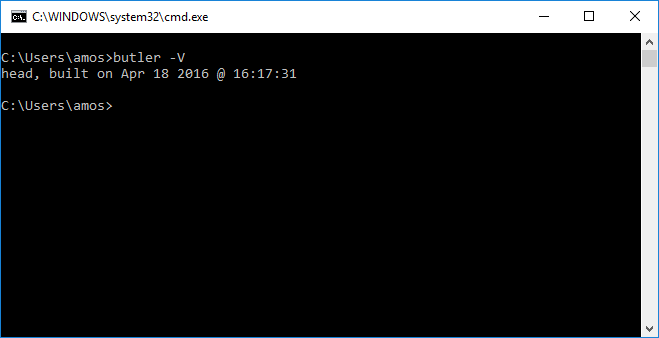

# Installing butler

## The human-friendly way

You can download stable and bleeding-edge builds of butler from its itch.io page:

  - <https://fasterthanlime.itch.io/butler>

Better yet, you can install it using the [itch app](https://itch.io/app), so it stays up-to-date.

## The automation-friendly way

You can download the latest, bleeding-edge version of butler from broth:

  - <https://broth.itch.ovh/butler>

broth is the download server used by the desktop app to install its own copy of butler.

The `-head` channels are bleeding-edge, the other ones are stable.

This is recommended if you need to install butler as part of a script, perhaps for continuous deployment

If you want to get the latest stable, for example, you could curl or wget the following URL:

  - <https://broth.itch.ovh/butler/linux-amd64/LATEST/archive/default>

You can substitute `linux-amd64` with any channel listed on broth.

The file served is a .zip file, and this URL redirects to an expiring download URL. Here's
an example bash script to install the latest stable butler for Linux:

```
# -L follows redirects
# -O specifies output name
curl -L -O butler.zip https://broth.itch.ovh/butler/linux-amd64/LATEST/archive/default
unzip butler.zip
# GNU unzip tends to not set the executable bit even though it's set in the .zip
chmod +x butler
# just a sanity check run (and also helpful in case you're sharing CI logs)
./butler -V
```

Note: the .zip file contains the butler executable, along with two dynamic
libraries related to 7-zip, which grant butler extra functionality. They're
not strictly required for `butler push`, however, they shouldn't hurt either.

If you need help integrating butler in your CI pipeline, butler's GitHub issue
tracker is a good place to ask: https://github.com/itchio/butler/issues/

## Adding butler to your path

Adding an executable to your path allows you to launch it from anywhere,
no matter which directory you're currently in.

### On Windows

[Follow this article](http://www.howtogeek.com/118594/how-to-edit-your-system-path-for-easy-command-line-access/) to add the folder where you downloaded butler.exe to your path.

*Alternatively, Windows will look into the current working directory when
looking for commands*

### On Linux

If you extracted butler to a directory (let's say `~/bin`), you first need
to mark it as executable. From a terminal, run:

```sh
chmod +x ~/bin/butler
```

(Replacing `~/bin` with the folder you actually want to store butler into)

Then, edit the `~/.bashrc` file (`~` is your home directory) and add this line
at the end:

```sh
export PATH="$PATH:~/bin"
```

(Again, replacing `~/bin` as appropriate)

You'll need to close and start a new terminal to apply the changes. You should
now be able to move on to the `First run` section.

**Alternatively**, if you want to use the version installed by the itch app,
you can skip the chmod command and use this line in your `~/.bashrc` instead:

```sh
export PATH="$PATH:~/.config/itch/apps/butler"
```

### On macOS

Follow the Linux instructions, except:

  * On macOS, the `~/.bash_profile` file is used instead of `~/.bashrc`
    * You may have to create that file if it doesn't exist yet.
  * If you want to use the itch app version, use this line in your `~/.bash_profile` instead:

```sh
export PATH="$PATH:~/Library/Application Support/itch/apps/butler"
```

*(don't forget the double-quotes, they're needed because there is a space in Application Support)*

As with Linux, don't forget to close and re-open your terminal to apply the changes.

## First run

To make sure butler is installed properly, open a terminal (`cmd.exe` on Windows),
and type the following command:

```bash
butler -V
```

*(that's a capital V, casing matters)*

It should print something like that:

```bash
head, built on Sep 13 2018 @ 10:59:39, ref 30fe1c38a9611d6b17dc61c7d4fb9582aa369d41
```

Or if you're using a stable version, `head` will be replaced by a [semantic version
number](http://semver.io/).

Here's how it looks on Windows:



*Note: of course, you can also run butler from PowerShell. But if you know
about PowerShell you probably didn't need to read most of this page anyway.*

## Appendix: Finding butler

If you ever forget where you put your butler.exe, the `butler which` command
will print its complete path.

## Appendix: What happened to dl.itch.ovh ?

If you followed these instructions before September 2018, you might have
download URLs starting with `dl.itch.ovh`. While new versions of butler are
still being deployed to that server for the time being, it is deprecated
and new CI setups should use the latest `broth.itch.ovh` URLs instead.

`dl.itch.ovh` was a simple storage bucket with a proxy in front. It did
the job, but some users were unable to access it, and download speeds were
sometimes suboptimal for non-US users. `broth.itch.ovh` serves downloads
through itch.io's CDN, which means every should have access and reasonable
download speeds.

Additionally, `dl.itch.ovh` served "naked binaries", whereas `broth.itch.ovh`
now serves .zip archives, because the full butler distribution is more than
one file. See the install instructions above for what these files are, and
example bash code on how to install butler from broth.
