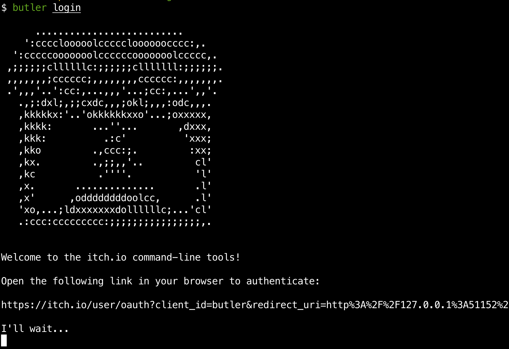
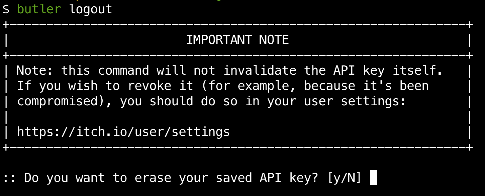

# Logging in

In order to use the `butler push` command, you'll need to grant butler access
to your itch.io account.

To do so, simply run the `butler login` command:



*If you forget this step, butler will ask you to login the first time you
use a command that requires credentials. No worries!*

Once you complete the login flow, your credentials will be saved locally.

## Logging out

If you want to erase them, you can use the `butler logout` command:



Like the note says, if the reason you want to erase your credentials is
that they've been compromised (someone gained access to your computer and
is using them), then you need to revoke them from your [user settings](https://itch.io/user/settings) instead

*Think of it as losing one set of your house keys: throwing away the
others won't help, you need to change the locks.*

## Working with multiple accounts

Although you can add other accounts as admin to your itch.io page, if you
need to use butler from different accounts on the same machine, you can
use the `-i` (or `--identity`) option to specify a different file to
save/read credentials from.

```bash
butler -i ~/.config/itch/other_itch_account_credentials push dir user/game:channel
```

On Linux and/or Mac, you might want to [make an alias](http://www.linuxhowtos.org/Tips%20and%20Tricks/command_aliases.htm) if you use it often.


