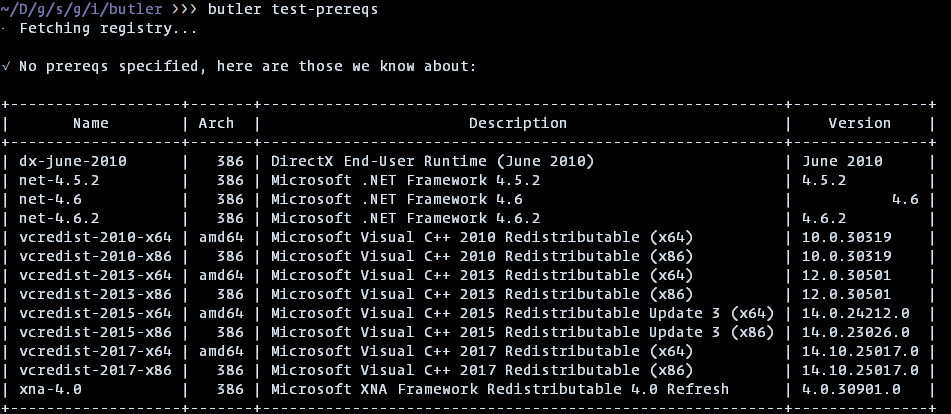
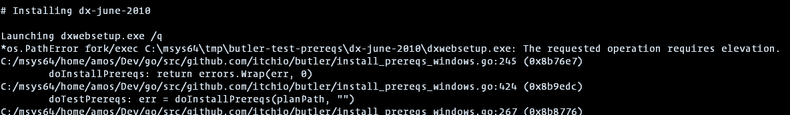
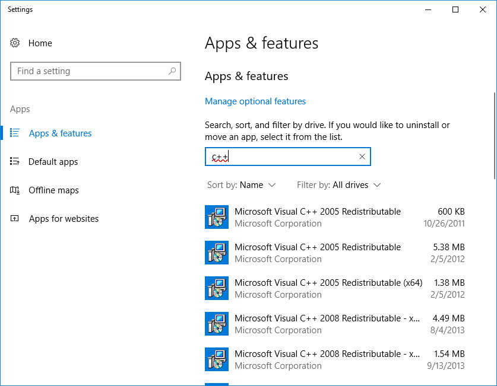
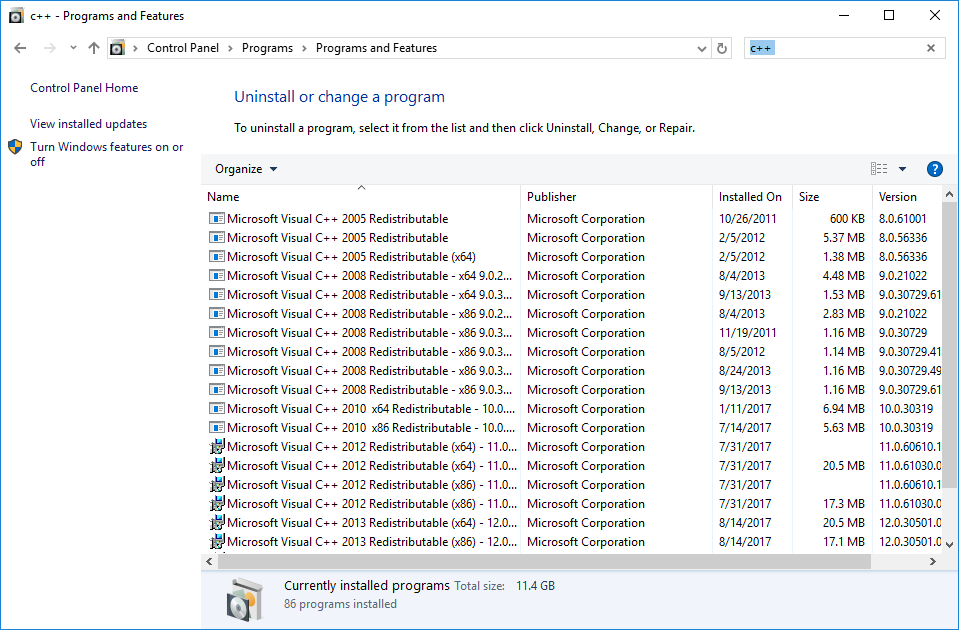

# Testing prerequisites with butler

The [itch.io app][] lets you specify frameworks or libraries to install when
your game is launched for the first time on a user's computer. These include
DirectX, .NET, Visual C++ Runtime, and so on.

> To learn how to specify prerequisites for your game,
> refer to the [Prerequisites page](https://itch.io/docs/itch/integrating/prereqs/)
> of the itch documentation.

[itch.io app]: https://itch.io/app

In rare cases, prerequisites installation may fail - they're all Windows
installers, and there exists various sets of conditions under which they
could potentially malfunction.

If you suspect you've found one such case, and want to investigate the
matter, you can use the `butler test-prereqs` command.

*Note: this command is only available in the Windows version of butler*

## Listing available prerequisites

Running it without any arguments will show a complete list of available
prerequisites:

## Installing specific prerequisites

Passing one or more names from the "Name" column of the list above
will try installing them. However, since most of them require administrative
rights to install, you will need to add the `--elevate` command-line flag.

If you forget `--elevate`, you'll see messages like these:

Depending on your security settings, you'll see an UAC dialog pop up
asking you if you want to let butler perform changes to your computer. If
you decline, the operation will be cancelled. If you accept, you'll see
logs of the download and install of the specified prerequisites:

## Uninstalling prerequisites

There is no command to uninstall them, but you can do so manually
by using "Add or remove Programs" section of the Windows settings:

Or:

Be careful though, as uninstalling them may disrupt other programs
that require them!
