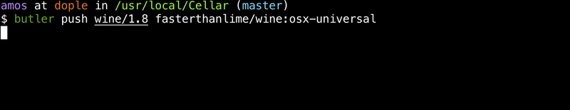
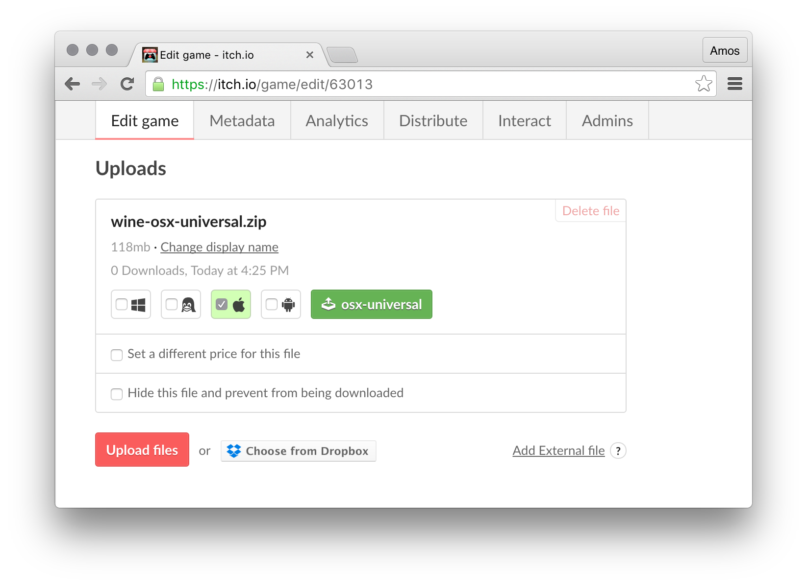

# Pushing builds with butler

The only command that you need to remember is `butler push`

```bash
butler push directory user/game:channel
```

Where:

  * `directory` is what you want to upload. It can also be a .zip file.
  * `user/game` is the project you're uploading
    * for example: `finji/overland` for https://finji.itch.io/overland — all lower-case
  * `channel` is which slot you're uploading it to
    * for example: `windows-beta`, `osx-bonus`, `linux-universal`, or `soundtrack`

*Channel names will determine the initial set of tags of a slot, but you can always fix them later.*

## Okay, show me

If you push the same directory twice:

  * The first push will take some time, all data actually needs to be uploaded



  * The next pushes will be almost instantaneous, since nothing changed


These are two extreme cases — most of the time, you'll be somewhere in the middle,
with maybe 5% to 20% fresh data in a push, saving 80% to 95% (more with compression)
of your data/time/internet bandwidth.

*Note: the first push is a `patch` too (from [the empty container](https://docs.itch.ovh/wharf/master/terminology.html) to the first version
of your game). It has savings as well, because butler uploads compressed data: you could be pushing a 300MB build but only sending 120MB over the network.*

Pushing to a new channel will make a corresponding file appear on your game's page:


Pushing to the same channel again will update that file, once the build is processed.

*Limits: currently, the itch.io backend will reject builds with a total uncompressed
size that exceeds 4GB.*

## Channel names

The name of a channel has meaning:

  * If it contains `win` or `windows`, it'll be tagged as a Windows executable
  * If it contains `linux`, it'll be tagged as a Linux executable
  * If it contains `osx`, it'll be tagged as a Mac executable
  * Channel names may contain multiple platforms (for example, a Java game could be pushed
    to `win-linux-mac-stable`)

*Limits: there is no way to tag channels with architecture (32-bit vs 64-bit) yet.*

**Hint: tagging a channel as 'HTML5 / Playable in browser' needs to be done from the
itch.io Edit game page, once the first build is pushed. The page also needs to be set
to 'HTML' rather than the default 'Downloadable'.**

The general convention for channel names is: lower-case characters, separated
by dashes (aka. `kebab-case`).

Naming your channel correctly will ensure your build is probably tagged
from the get-go. However, you can always change it later from the *Edit game* page,
by using the checkboxes.



*Don't forget to `Save` the game's page to apply your changes.*

Clicking on the green channel button will show a list of builds and their
current status.

## Specifying your own version number

By default, the itch.io backend will generate a constantly-increasing integer
version number for your builds, for each channel.

However, if you're already generating your own build number, you should
pass it to butler with the `--userversion` option:

```bash
butler push mygame user/mygame:win32-final --userversion 1.1.0
```

You can also instruct butler to read the version number from a given file,
if it fits your workflow better:

```bash
butler push mygame user/mygame:win32-final --userversion-file buildnumber.txt
```

*The `buildnumber.txt` file should contain a single line with the
version or build number.*

User-provided version numbers don't have any particular format -
the ordering itch.io uses is the one builds are uploaded in.

## Looking for updates

Players who prefer downloading directly rather than using [the itch app](https://itch.io/app)
don't get automatic updates. You can use the following API endpoint to query the latest version
of a game and notify your players from within the game, that a new version is available:

```
GET https://itch.io/api/1/x/wharf/latest
```

*Parameters*:

  * `channel_name`: the name of the channel to query
  * either of these:
    * `game_id`: (numeric) identifier of the game (find it in *Edit game*)
    * `target`: user/game, just like the `butler push` command

*Response*: a JSON object with the latest user-version for the given channel:

```json
{
  latest: "106"
}
```

If the latest build doesn't have a user-version, the `latest` field will not be present.

*Example requests*:

```
https://itch.io/api/1/x/wharf/latest?target=user/game&channel_name=win32-beta
```

or

```
https://itch.io/api/1/x/wharf/latest?game_id=123&channel_name=osx-final
```

(You can find the `game_id` from the *Edit game* page's address)

*Note: if the game's visibility level is set to `Private`, this endpoint will return
the error 'invalid game', to avoid potentially leaking information about unreleased games.*

## Appendix A: Understanding the progress bar

`butler push` does a lot of work, most of it in parallel:

  * Signature of the previous build (if any) is downloaded
  * Files from the local directory/archive are scanned
  * Differences between the local (newer) & remote (older) build are
    * computed (by comparing hashes, see the [Wharf specification](https://docs.itch.ovh/wharf/))
    * ...and compressed (with a fast preset)
    * ...and uploaded to [itch.io](https://itch.io)

In addition:

  * butler doesn't use any additional disk space while uploading
  * butler doesn't require a cache in-between uploads
    * You can upload from a different machine every time
  * butler tries really hard to use less than 256MB of RAM


By design, progress bar shown by `butler push` has two parts:

  * The half-tone bar shows the progress of scanning files & generating the patch
  * The full bar shows the progress of uploading the generated patch

Neither of these bars jump back. The half-tone bar may pause, waiting for the
full bar bar to catch up: this means butler is waiting to send the patch data
it has already generated before scanning more files, and it helps keeping
memory usage reasonable.

The estimated time remaining is to be taken with a grain of salt, as are
all ETAs.

## Appendix B: Beeps 4 life

The default windows command-line uses a character set named [Code page 437](https://en.wikipedia.org/wiki/Code_page_437). Its historical relevance goes back to the days where Unicode wasn't yet ubiquitous.[^1]

In the early days of butler, we were using the CP437 character `007` to display
bullet points (whenever butler starts a new task). However, that particular
character is also used to emit a system beep[^2].

This was a bug, of course, but [early users](https://twitter.com/ADAMATOMIC) got attached
to it. It was *soothing*. The bug has since been fixed, but the historical behavior can be
restored by using the `--beeps4life` option.

*Note that this option is not listed in the program's inline help.*

[^1]: It still isn't really, but you get the idea.
[^2]: Historically, from your computer's [PC speaker](https://en.wikipedia.org/wiki/PC_speaker). Now, probably whatever sound Microsoft bundles with your version of Windows.
