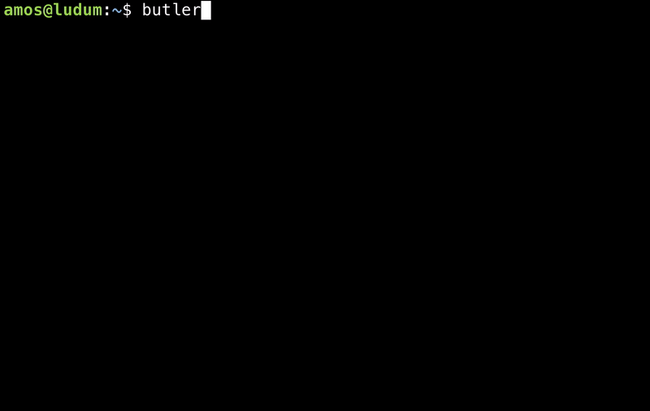
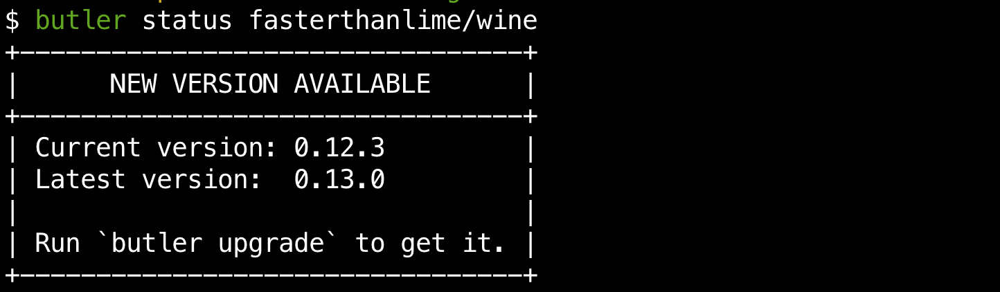

# Upgrading butler

Since butler is a single executable file, you can always upgrade it at any
time by downloading a newer version (from the links given in the [Install page](installing.md))
and replacing your current version with it.

However, the `butler upgrade` command provides an easier way to upgrade
to a newer version.

When running network commands like `butler push` or `butler status`,
butler will run a version check in the background, and display a notice
if one is available:

